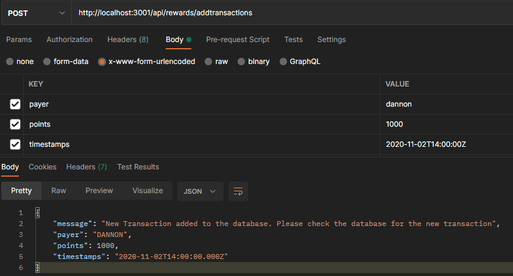

## Fetch Rewards Coding Exercise - Backend Software Engineering

## Description

A backend restful API web service that accepts HTTP requests and returns responses based on the conditions outlined in the next section.

## Technologies:

- Node.js - cross-platform JavaScript runtime environment
- ExpressJS - backend Node.js server framework for creating RESTful APIs
- Mongoose - MongoDB ORM
- MongoDB - MongoDB database
- Jest for testing and coverage
- Postman (for testing) and RESTful API testing tools

## Table of Contents

- [Description](#description)
- [Technologies](#topics)
- [Installation](#installation)
- [Making API calls](#making-api-calls)
- [License](#license)
- [Badges](#badges)

## Installation

Before installing this application on your local computer, ensure that you have Node, NPM and MongoDB installed globally on your machine. This application works in Node. You can go to the following website to download Node: <a href='https://nodejs.org/en/'>Node</a>, you can go to the following website to download NPM: <a href='https://www.npmjs.com/'>NPM</a>. You can go to the following website to download MongoDB: <a href='https://www.mongodb.com/'>MongoDB</a>. You can also go to the following website to download Jest: <a href='https://jestjs.io/'>Jest</a>.
If you don't have Postman it's fine you can use any of api testing software, if you don't you can go to the following website to download Postman: <a href='https://www.getpostman.com/'>Postman</a>.

Installation:

    1. Clone the repo or download the zip file to your local machine
    2. Open repo in vscode or text editor of choice
    3. Go to the root directory of the project
    4. npm install

To Start Server:

    - npm run server
    - Your server will be running on port 3001

## Making API calls

Note: We are using Postman to make API calls, any other API testing software can be used as well.

## POST route api/rewards/addtransactions

Accepts a body format

For each call, the body should contain the following:

- { "payer": <string>, "points": <integer>, "timestamps": <ISO8601> }

* Enter the server port with the -/addtransactions- endpoints in the URL bar.

  - Under the URL bar, select Body, check x-www-form-urlencoded, and enter the following:

  -under Key - write payer

  -under Value - enter payer name

  -under Key - write points

  -under Value - enter points

  -under Key - write timestamps

  -under Value - enter timestamp in ISO8601 format

Click -send- and you should see a -Status:201 Created- response.

## POST route api/rewards/spendpoints

The body should contain the following:

- { "points": <integer> }

Accepts a body format

- Enter the server port with the -/addtransactions- endpoints in the URL bar.

* Under the URL bar, select Body

* check x-www-form-urlencoded, and enter the following:

-under Key - write points

-under Value - enter points

Click -send- and you should see a -Status:200 OK- response.

## GET route api/rewards/pointsbalance

The body should be empty.

- Enter the server port with the -/pointsbalance- endpoints in the URL bar.

* Under the URL bar, select Body

* check x-www-form-urlencoded,

Click -send- and you should see a -Status:200 OK- response.

(./images/getbalance.gif)

## Running Test

    1. Run the test file with the following command:
    2. npm run test

The test file will run the following tests:

- -POST- a new transaction
- -POST- spend points
- -GET- points balance
